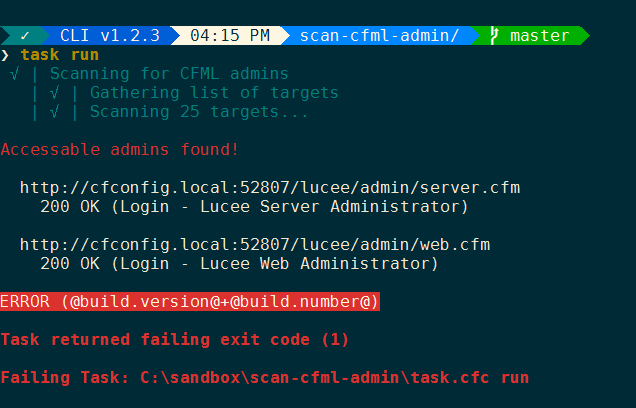
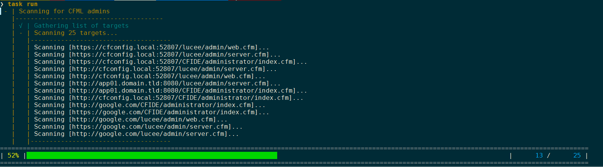
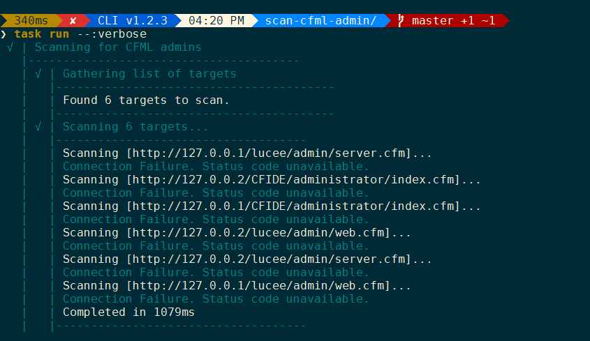

# Scan CFML Admin

This repo is a fun proof of concept to show a CFML equivalent to the Python version written by [Joseph Lamoree](https://github.com/jlamoree).  All credit for the idea goes go him.

https://github.com/ecivis/scan-cfml-admin

I just copied his spec and rewrote it in CFML using a [CommandBox task runner](https://commandbox.ortusbooks.com/task-runners).  This could very easily be made into a custom command you install globally, but adding a `ModuleConfig.cfc`, `box.json` and pubilshing it for [ForgeBox](https://www.forgebox.io).

## Improvements

This CFML version uses the [InteractiveJob](https://commandbox.ortusbooks.com/task-runners/interactive-jobs) helper to produce nice output from the job.



If one or more CFML admins are located, the tas, returns a failing exit code making it suitable to be used as part of an automation

The target scanning is performed in parallel for faster response times if you have a lot of targets, or they are slow to respond.

When verbose is active, the total number of miliseconds elapsed during scannnig is reported.

The task uses the generic progress bar feature in CommandBox task runners to show a progress bar as it scans the targets.



## Intro

This utility exists to help locate CFML engine administration interfaces that have a greater exposure than intended. It scans URLs generated by target definitions and attempts to identify the login page by page title.

## Setup

Just clone this repo or copy the `task.cfc` as a standalone file and place it in a directory of your choice.

```bash
git clone https://github.com/bdw429s/scan-cfml-admin.git
cd scan-cfml-admin
```

## Usage
The program reads a JSON file containing targets to scan. It logs information found while scanning. Apparent instances of the Lucee and Adobe ColdFusion administrator interfaces are logged as warnings.

By default, if there is a file named `targets.json` in the same working dir as the task.cfc, it will be used automatically.

```
box task run 
```

Or you can specify a file via relative or absolute path like so:
```
box task run :targetsFile=targets.json
```

## Targets

The JSON file is an array of target definitions of the following types.  

### Hostname

The program will expand one hostname or multiple hostnames to check for administrator interfaces at both protocol schemes and from both CFML engine vendors. Consider the following chunk of JSON:
```
[
    {
        "hostname": [
            "domain.tld",
            "app.domain.tld"
        ]
    }
]
```
Those two hostnames will be expanded to cause the following scanned URLs:
* http://domain.tld/lucee/admin/server.cfm
* https://domain.tld/lucee/admin/server.cfm
* http://domain.tld/lucee/admin/web.cfm
* https://domain.tld/lucee/admin/web.cfm
* http://domain.tld/CFIDE/administrator/index.cfm
* https://domain.tld/CFIDE/administrator/index.cfm
* http://app.domain.tld/lucee/admin/server.cfm
* https://app.domain.tld/lucee/admin/server.cfm
* http://app.domain.tld/lucee/admin/web.cfm
* https://app.domain.tld/lucee/admin/web.cfm
* http://app.domain.tld/CFIDE/administrator/index.cfm
* https://app.domain.tld/CFIDE/administrator/index.cfm

### IP Address

One or more IP addresses can be provided as a target definition:
```
[
    {
        "ip": "1.2.3.4"
    }
]
```

For this target definition, https expansion will not be performed. These are the resulting URLs to be scanned:
* http://1.2.3.4/lucee/admin/server.cfm
* http://1.2.3.4/CFIDE/administrator/index.cfm

If interest exists, this target definition could be enhanced to scan a given CIDR expression.

### Base URL

This target definition allows one or more base URLs to be used with CFML engine vendor expansion:
```
[
    {
        "baseurl": [
            "http://app01.domain.tld:8080",
            "http://app01.domain.tld:8081"
        ]
    }
]
```

This target definition will expand to the following URLs:
* http://app01.domain.tld:8080/lucee/admin/server.cfm
* http://app01.domain.tld:8080/CFIDE/administrator/index.cfm
* http://app01.domain.tld:8081/lucee/admin/server.cfm
* http://app01.domain.tld:8081/CFIDE/administrator/index.cfm

### URL

The URL target definition explicitly defines a location to scan; no expansion will be performed. This allows specifying a non-standard location to evaluate:
```
[
    {
        "url": [
            "https://admin.domain.tld:8889/admin/cfml/"
        ]
    }
]
```
The program will scan only the URL provided, and display a warning if HTTP 200 OK is returned. To help identify false positives, the title of the HTML page is logged. A project enhancement might be to accept strings to seek in the content.

### Skipping

It is possible to skip target definitions by adding the skip property. For example:
```
[
    {
        "hostname": "domain.tld",
        "skip": true
    }
]
```

### Documenting

Since JSON doesn't allow comments without hackery, it can be difficult to include in-line documentation. The description property is suggested for this purpose:
```
[
    {
        "description": "This is the new server to be validated",
        "hostname": "new.domain.tld"
    }
]
```


## Options

If scanning for both CFML engine vendor administration interfaces is unnecessary, use the vendor command line argument argument to specify lucee or adobe:
```
box task run :vendors=lucee

box task run :vendors=adobe

box task run :vendors=all
```
This will reduce the number of URLs scanned for target definitions that perform expansion.


To see the full status code of all URLs hit, you can pass the `verbose` flag.


```
box task run --:verbose
```




## License

This project is available under the MIT License. See LICENSE.
